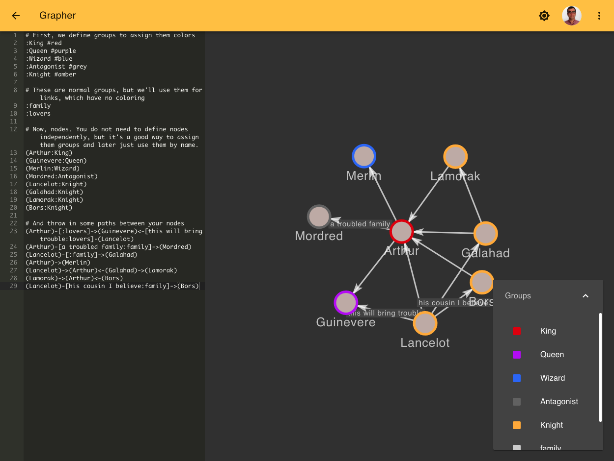

[](https://conventionalcommits.org)
[](https://circleci.com/gh/davidballester/grapher/tree/master)

# Grapher

Grapher is a graph editor. It's that simple!



## Setup

Setting up grapher locally is really simple.

Install dependencies:

```Bash
npm install
```

And run it

```Bash
npm start
```

## Storage

Graphs are stored in your [browser's local storage](https://developer.mozilla.org/es/docs/Web/API/Window/localStorage). Because of that, it can be considered volatile, so be careful!

You can download a JSON version of your graph that you can then use to import the graph again into grapher. Use that feature as backup method.

---

<small>This project was bootstrapped with [Create React App](https://github.com/facebook/create-react-app).</small>

<small>UI components by [Material-UI](https://material-ui.com/).</small>

<small>Grammar by [Ohm](https://ohmlang.github.io/).</small>

<small>Forms by [Formik](https://jaredpalmer.com/formik/).</small>
